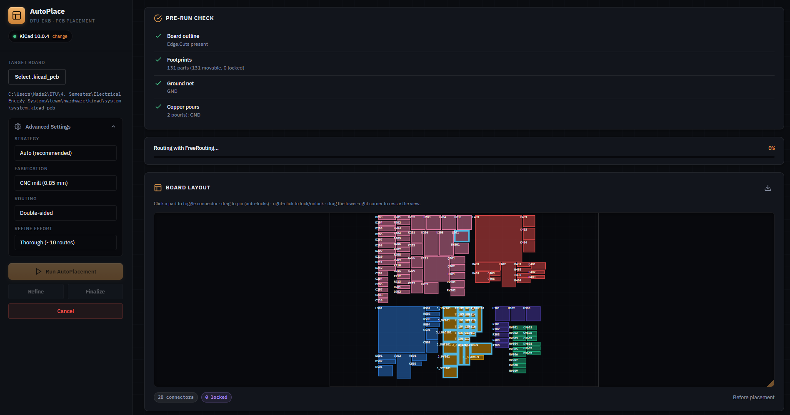
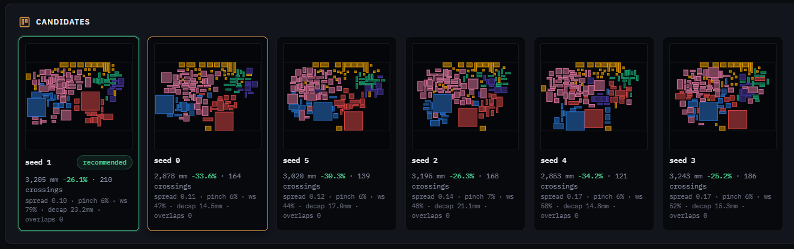
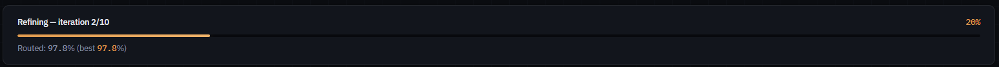
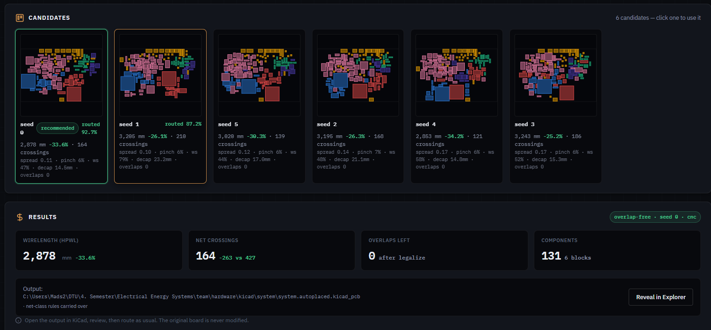
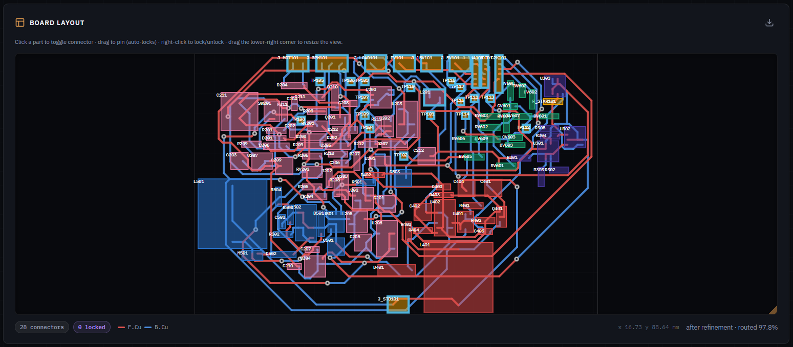
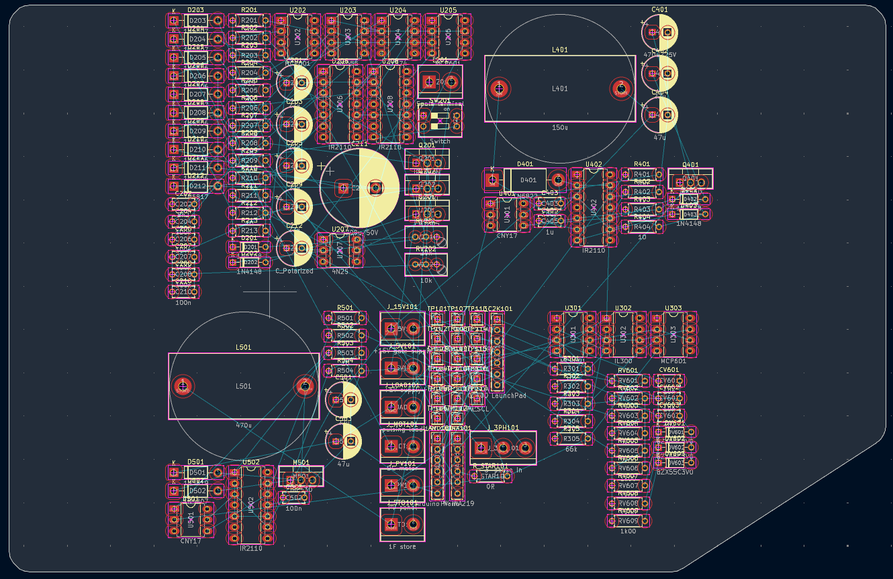
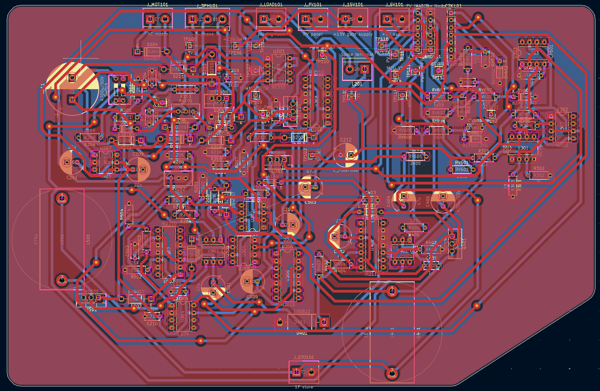
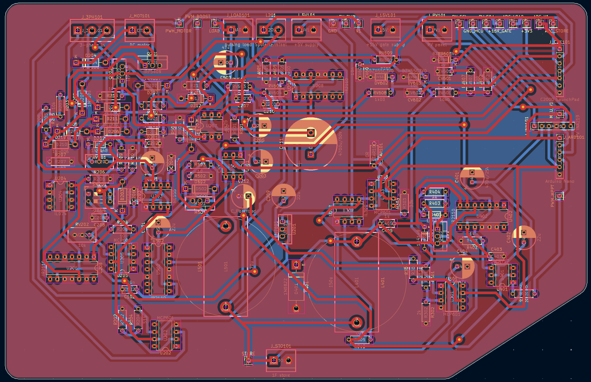
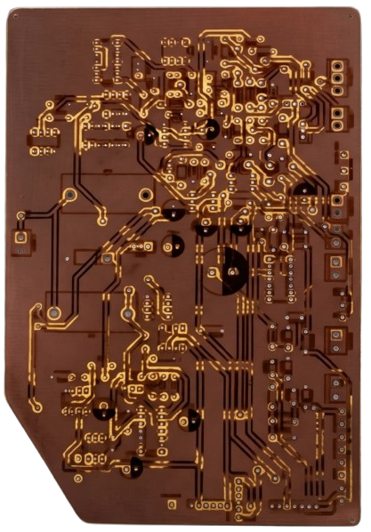
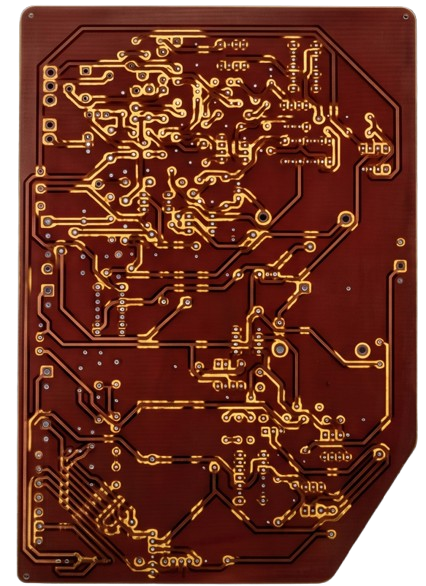

# KiCad-Autoplace

Connectivity-aware **automatic PCB placement and routing** (single- or
double-sided) for KiCad, as a desktop app. Built for students at DTU Ballerup Campus. A companion to
[KiCad-components](https://github.com/DTU-EKB/KiCad-components) — that repo gives
you the symbols and footprints, this one places and routes them.

You prepare the board in KiCad (outline, locked crucial parts, ground pours),
then the app places the rest, routes it with FreeRouting, and hands back a
finished `.kicad_pcb`.

## What it does

- **Multi-seed placement** — generates several placements and shows them as a
  gallery; you pick the one you like.
- **Connectors on edges** — click footprints to mark them; they're auto-placed on
  the board edge. **Locked** parts are never moved.
- **Ground/power planes** — fills every copper pour on its own net so the router
  treats GND/power as planes instead of routing them as traces.
- **Fabrication profiles** — CNC mill (0.85 mm) or fiber laser (0.8 mm) sets the
  clearance/track rules on the output.
- **Route-driven refinement** — routes with FreeRouting and re-anneals congested
  spots; **single-** or **double-sided** (single-sided ends up on B.Cu).
- **Finalize** — promotes the routed board to the project's main `.kicad_pcb` and
  sweeps the intermediate files (keeps a `.bak`).
- **Pre-run checklist** — flags a missing outline, ground net, or pours before you
  run.

## Screenshots

**The app** — load a board, generate and score placement candidates, refine, and route:











**A real board, start to finish** — raw import, auto-placed and routed, then fabricated:










## Requirements

- **KiCad 10** (the app uses its bundled `pcbnew`; auto-detected).
- **Node.js** to run the Electron app.
- **Java + FreeRouting** for routing/refine — jar at
  `~/.freerouting/freerouting-1.9.0.jar`.

## Run the app

```bash
cd app
npm install
npm start
```

## Prepare your board first (in KiCad)

- Draw the **Edge.Cuts** outline (the placement boundary).
- **Lock** any crucial parts you've hand-placed — they won't be moved.
- Add **GND** (and power) copper **pours**.

The app's pre-run checklist tells you if any of these are missing.

## Workflow in the app

1. Select your `.kicad_pcb`.
2. Click the connector footprints to mark them (placed on edges).
3. Pick **Fabrication** (CNC / laser) and **Routing** (single / double sided).
4. **Run AutoPlacement** → pick the best candidate from the gallery.
5. **Refine** (route-driven) → review the routed %.
6. **Finalize project** → promotes the routed board and cleans up.

## Develop / run headless

The engine core is pure Python (no `pcbnew`); `kicad_io` / `routing` / `refine`
bridge KiCad. Run subcommands with KiCad's Python:

```powershell
& "C:\Program Files\KiCad\10.0\bin\python.exe" cli.py place    board.kicad_pcb
& "C:\Program Files\KiCad\10.0\bin\python.exe" cli.py preflight board.kicad_pcb
```

Subcommands: `place`, `place-multi`, `refine`, `finalize`, `preflight`, `dump`,
`metrics`. The headless unit tests run under any Python:

```bash
python -m pytest tests/
```

## Layout

```
app/                       # Electron desktop app (main / preload / renderer)
plugin/plugins/autoplace/  # engine: pure-Python core + kicad_io/routing/refine
cli.py                     # headless runner the app drives
tests/                     # headless unit tests (no pcbnew)
docs/                      # design specs (docs/superpowers/specs)
```

The same engine also ships as a KiCad PCM plugin (`plugin/`, `repository.json`),
but the desktop app is the primary interface.

## License

MIT — see [LICENSE](LICENSE).
